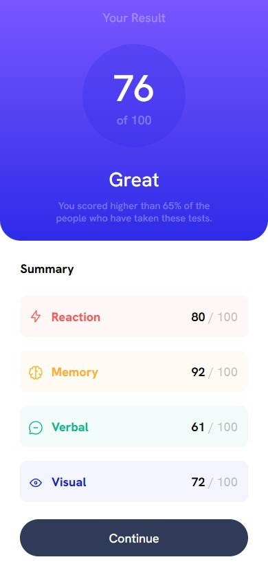
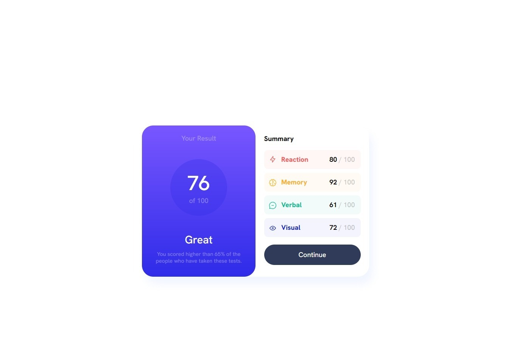
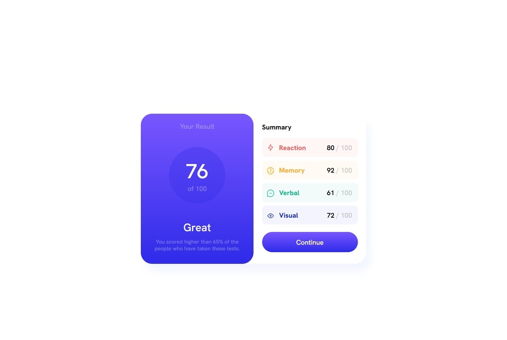

# Frontend Mentor - Results summary component solution

This is a solution to the [Results summary component challenge on Frontend Mentor](https://www.frontendmentor.io/challenges/results-summary-component-CE_K6s0maV). Frontend Mentor challenges help you improve your coding skills by building realistic projects. 

## Table of contents

  - [The challenge](#the-challenge)
  - [Screenshot](#screenshot)
  - [Links](#links)
- [My process](#my-process)
  - [Built with](#built-with)
  - [What I learned](#what-i-learned)
  - [Continued development](#continued-development)
- [Author](#author)
- [Acknowledgments](#acknowledgments)

### The challenge

Users should be able to:

- The challenge was starting from the mobile version and then adapting it to the desktop
- See hover state for button element on the page

### Screenshot

### Links

- Live Site URL: [Live site URL here](https://smailen5.github.io/results-summary-component-main/)

### My process

### Built with

- Semantic HTML5 markup
- CSS custom properties
- Flexbox
- Mobile-first workflow

### What I learned

In this exercise I improved my understanding of @media.I used the pseudo class :hover also adding cursor pointer and removing the possibility that the user can select the text of the button by mistake.

### Continued development

I want to focus more on Media Queries, I understand the basics but, I want to create better responsive layouts. I think I need to study Bootstrap to improve CSS code reading, the class names I use are not always comprehensive at first glance.

## Author

- GitHub - [Smailen5](https://github.com/Smailen5)
- Frontend Mentor - [Smailen5](https://www.frontendmentor.io/profile/Smailen5)
- Linkedin - [Smailen Vargas](https://www.linkedin.com/in/smailen-vargas/)

## Acknowledgments

Thanks to [@Bader-Idris](https://www.frontendmentor.io/profile/Bader-Idris) for the advice, on the previous challenge, to use
   .container {
  position: absolute;
  top:50%;
  left: 50%;
  transform: translate(-50%, -50%);
}
to center the containers

